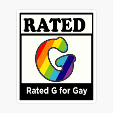

# ***Prideconnections  ***

About PrideConnections:

PrideConnections is a groundbreaking mobile application designed to revolutionize the LGBTQ community's event-sharing and finding experience. Our app serves as a centralized platform, empowering users to discover, share, and participate in a wide array of LGBTQ events taking place locally and globally. With PrideConnections, we aim to create a safe and inclusive space where individuals can connect, celebrate, and support one another.

Our Objectives:

1. Facilitate event discovery: PrideConnections makes it effortless for users to explore LGBTQ events through comprehensive event listings. With intuitive categorization based on type, location, and date, finding the perfect event becomes a breeze.
2. Enable event sharing: We believe in the power of community participation. PrideConnections provides user-friendly event submission forms, empowering event organizers to share the details of their events effortlessly.
3. Foster community engagement: We foster vibrant community engagement through personalized user profiles that showcase interests and preferred event types. Users can actively participate in event discussions, leave comments and ratings, and connect with like-minded individuals through private messaging.
4. Promote inclusivity: Inclusivity is at the heart of PrideConnections. We promote diverse and inclusive events, ensuring that every individual finds a place where they feel welcomed and represented.
5. Enhance user safety: Safety is paramount in our application. We have implemented a robust reporting system to address inappropriate content, user blocking and moderation features, and privacy settings that allow users to control the visibility of their personal information.

Key Features:

1. Event Listing and Search: Explore a wide range of LGBTQ events with comprehensive listings, advanced search filters, and integration with mapping services for easy navigation.
2. Event Submissions and Management: Event organizers can effortlessly share event details through user-friendly submission forms, manage their events through a dedicated dashboard, and benefit from a review and moderation system.
3. User Profiles and Social Interaction: Personalize your profile to showcase your interests and preferred event types. Engage with the community through event discussions, comments, ratings, and private messaging.
4. Notifications and Reminders: Stay up-to-date with push notifications for new events and updates. Set reminders for events you plan to attend, ensuring you never miss out on the latest LGBTQ happenings.
5. Safety and Reporting: PrideConnections prioritizes user safety through a robust reporting system, user blocking, moderation features, and privacy settings.

Implementation:

PrideConnections will be developed as a cross-platform mobile application for both iOS and Android devices. Our skilled team will utilize CSS, JavaScript, and HTML for the front-end development, while employing modern technologies for the back-end. Throughout the development process, we adhere to industry best practices, ensuring high-quality code and optimal performance.

Monetization:

To sustain the application and continue providing valuable services to the LGBTQ community, we plan to implement various monetization strategies, including:

1. Sponsored event listings or promoted events to enhance event visibility.
2. In-app advertising from LGBTQ-friendly businesses and organizations, promoting their products and services.
3. Premium features or subscriptions offering enhanced functionality and exclusive event access, catering to users seeking additional benefits and unique experiences.

Join PrideConnections today and become part of a vibrant and supportive LGBTQ community, where events, connections, and celebrations flourish!
